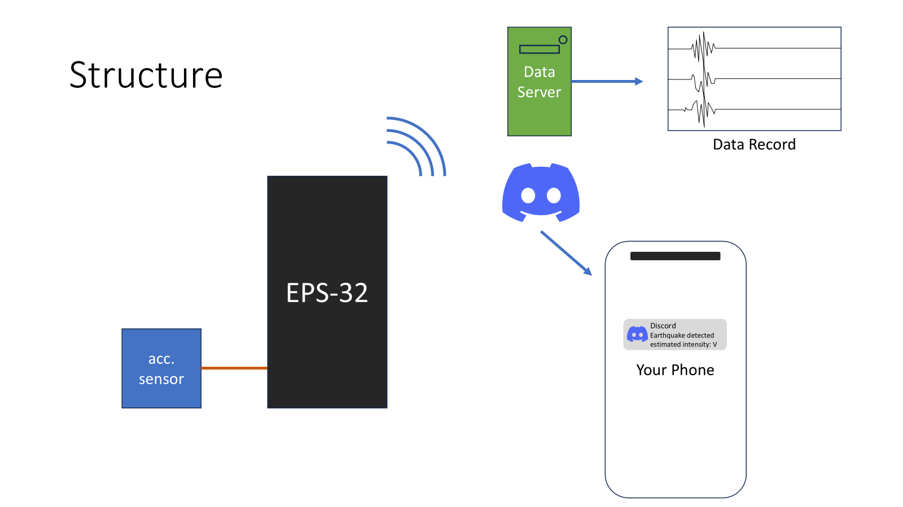
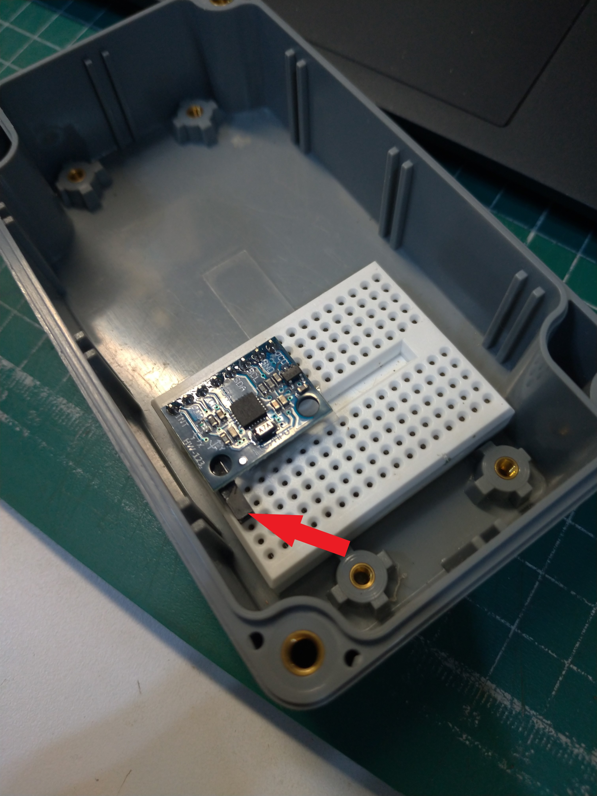

# May 25th: Research and Design + Build a Prototype.

I finally decided to start this project. I've been wanting to make something useful and about earthquake since I lived in a place with lots of earthquake.

The function I planned to have are:
- detect earthquake
- record the acceleration data for further research
- send notification to discord

Here's a quick picture explaining this:

So the things I would need:
- EPS32 (controlling the sensor)
- An accelerometer (of course, for obtaining data)
- A case (for dust protection)
- A data server (for collecting data)

I'll use an ESP-32 dev module to control the hardware because I'm more familiar with it.

Next, I'll need an acceleration sensor. I ask Gemini for suggestion on the sensors, but it seemed like ADXL345 and MPU6050, which I already have, are the most sensitive sensor I can find.

So I read through the data sheet of the [ADXL345](https://www.analog.com/media/en/technical-documentation/data-sheets/adxl345.pdf) and [MPU6050](https://invensense.tdk.com/wp-content/uploads/2015/02/MPU-6000-Datasheet1.pdf).

After all, I decide to use MPU6050 because its extensibility. It has an accelerometer and a gyroscope, which might make it more possible for something more complicated than only an accelerometer.

I use a breadboard to hold my sensor, which it flat enough at the bottom to make the sensor stable, and also I glued a little piece of plastic that somehow just fit the height of the sensor to hold the sensor's other end. 

<!-- I also looked up for some library for MPU6050, hope I can find one soon. -->

Then, I found a library for MPU6050 and spend about one hour trying to understand the example program.

**Total time spent: 4h**